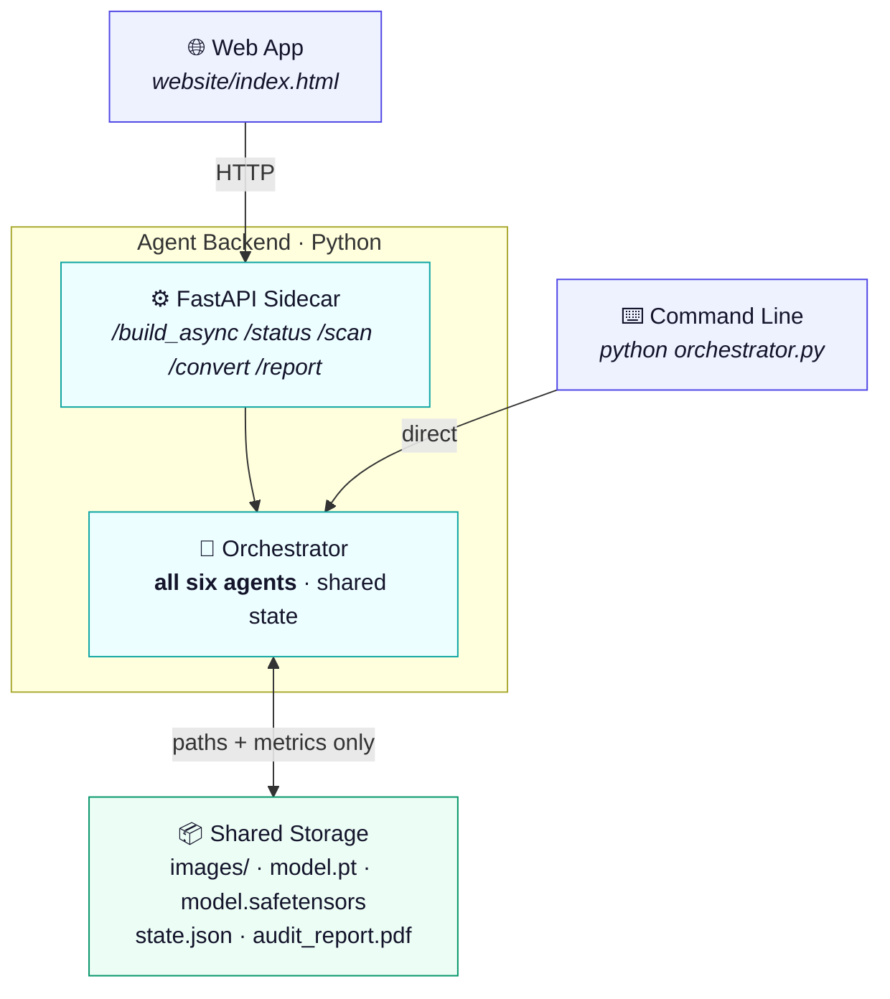
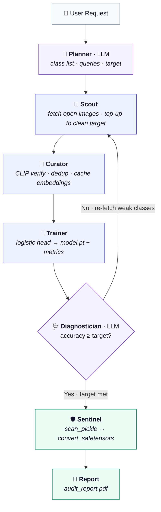
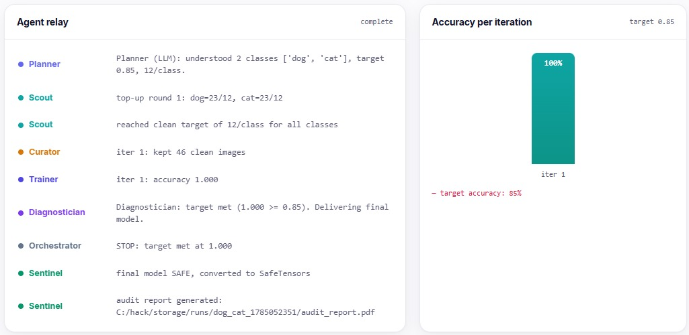

# ModelSmithAI (Standalone)

**Your Autonomous Model Factory — from a plain-English request to a security-scanned, ready-to-use model in minutes.**


*Team Kernels · Amrita University Coimbatore*

---

## Overview

Describe what you want to recognize in plain English; six coordinated AI agents gather open-licensed data, train a model, diagnose their own failures, gather better data, and deliver a **security-scanned model + audit report** — no dataset, no labeling, no code required.

This is the **standalone** edition: pure Python agents plus a static web UI. No platform, no framework beyond FastAPI, no build step, no cloud.

---

## Problem

Building a model for a **niche/long-tail task** (a specific defect, species, or document type) is slow and manual:

- **No ready datasets** exist on Kaggle/Roboflow — sourcing and labeling data takes days to weeks.
- **Requires an ML expert** to run the source → clean → train → diagnose → re-source loop.
- **Downloaded models are unsafe:** PyTorch `.pt` files use `pickle`, which executes arbitrary code on load (RCE risk — e.g. **CVE-2025-1889**, where scanners are bypassed by hiding payloads under fake extensions).

## Solution

An autonomous, self-improving multi-agent pipeline that solves both **data scarcity** and **model trust**:

- Gathers open-licensed images, verifies each with zero-shot CLIP, trains, and **reasons about its own failures** to fetch better data — improving until it hits a target or the open data is exhausted.
- **Scans** every model for malicious pickle opcodes (by content, not filename) and **converts to SafeTensors** — a format with no code-execution path. *Detection is evidence; conversion is the guarantee.*

---

## Key Features

- **Natural-language → trained model.** LLM parses the request into a class list.
- **Six-agent self-improving loop** with a *reasoning* Diagnostician that issues structured, per-class re-fetch requests.
- **Multi-source harvesting** (Openverse, Wikimedia) with per-image **source + license** recorded; graceful failure and fresh-page re-fetch.
- **Zero-shot CLIP verification** + embedding-similarity dedup; rejects moved to `_rejected/` (inspectable).
- **Clean-image top-up:** fetches until *N* clean images survive, or the source is exhausted (hard round cap — no infinite loops).
- **Fast training:** CLIP embeddings (cached once) → logistic head → real `.pt` in ~1s.
- **Local LLM reasoning** (Ollama) in Planner + Diagnostician, each with a **deterministic fallback** so a demo never breaks.
- **Security (Sentinel):** load-free pickle scan + SafeTensors conversion, with a malicious-file fixture to prove detection.
- **Auto-generated PDF audit report:** request, accuracy progression, data provenance/licenses, agent decision log, security verdict.
- **Two surfaces, one backend:** web app · command line. Every agent is also its own HTTP endpoint, so the Sentinel is usable standalone against any `.pt`.

---

## Tech Stack

| Layer | Tech |
|---|---|
| Agent backend | Python 3.12, FastAPI, Uvicorn |
| Frontend | Static HTML + vanilla JS (no build step) |
| Vision | OpenCLIP `ViT-B-32` -> scikit-learn `LogisticRegression`; PyTorch (CPU/CUDA, RTX 3050 6GB) |
| LLM | Ollama local (`qwen2.5:3b`) over HTTP |
| Data | Openverse, Wikimedia Commons, HF datasets (discovery) |
| Security | `pickletools`, `safetensors` |
| Reporting | ReportLab |

---

## The Six Agents

| Agent | Module | Capability | Reasoning |
|---|---|---|---|
| **Planner** | `plan.py` | free text -> class list, per-class queries, target, iteration cap | LLM, regex parser fallback |
| **Scout** | `scout.py` | multi-source open-licensed fetch, page offsets, query broadening, provenance manifest | deterministic |
| **Curator** | `curate.py` | CLIP zero-shot verify (own class must win softmax and clear 0.24), dedup at 0.98 cosine, embedding cache | deterministic |
| **Trainer** | `train_real.py` | logistic head on cached embeddings, stratified 75/25 split -> `model.pt` + metrics | deterministic |
| **Diagnostician** | `diagnose.py` | reads accuracy / per-class recall / confusion pairs -> `STOP` or a structured re-fetch request | LLM, heuristic fallback |
| **Sentinel** | `sentinel.py` | disassembles pickle bytecode without loading, then converts to SafeTensors | rule-based by design |

**Reasoning is placed deliberately** — the LLM handles judgment (intent, failure analysis); everything computational and everything security-critical is deterministic.

---

## System Architecture

One agent backend, two independent front-ends. The web app talks to the Python sidecar over HTTP; the CLI drives the orchestrator directly. Neither routes through the other.



- **Orchestrator** runs the loop, holds shared state, decides next step.
- **Every agent is individually addressable** over HTTP — zero glue code needed to reuse one.
- **Files never pass between layers** — only paths + metrics (JSON). The artifact stays in storage.
- `/build_async` returns a `job_id` immediately and runs the loop on a worker thread, tee-ing the agent log into a per-job buffer; the browser polls `/status/{job_id}` to animate the relay live.

---

## Agentic AI Workflow



*Loop stops on: target met · no improvement · max iterations.*

- **A met target is a hard rule above the LLM** — at or above target the Diagnostician stops immediately, without an LLM call, so loop behaviour stays predictable.
- **Metrics get the final word.** If the LLM names only some of the failing classes, any class under 0.7 recall it missed is appended to the next fetch plan anyway.
- Every inter-agent message is appended to `state.json` as it happens — that shared state is the audit trail, the PDF's source, and what the UI streams. There is no hidden channel between agents.

---

## Real-World Use Cases

- **Factory QC, no dataset:** train "defective vs clean casting" for a specific part in minutes, with a licensing audit trail.
- **Team without an ML engineer:** describe classes in English, get a working, safe model.
- **MLOps vetting:** scan any downloaded `.pt` for malicious code and get a safe SafeTensors version — the Sentinel is valuable standalone.
- **Education:** demonstrate the full data->model loop live, including the model failing and the system fixing itself.

---

## Benefits & Impact

- **Speed:** days/weeks of data work -> minutes.
- **Access:** model-building without ML staff, datasets, or code.
- **Trust:** every model de-risked from pickle RCE before use.
- **Governance:** standardized SafeTensors + PDF audit with data provenance.
- **Privacy:** LLM reasoning runs locally — no data leaves the machine.

---

## Innovation / USP

1. **Self-improving loop with a *reasoning* Diagnostician** — issues machine-readable, per-class data requests, not "accuracy low."
2. **Security as a guarantee, not a scan** — SafeTensors conversion removes the code-execution surface regardless of scanner coverage; content-based archive walk defeats CVE-2025-1889-style bypasses.
3. **Reasoning placed where it counts** — LLM for judgment, deterministic for computation/security.
4. **Provenance + audit by default** — answers "where's the data from?" and "is it safe?" automatically.
5. **Runs anywhere, depends on nothing** — pure Python plus a static page. Clone, `pip install`, run; no platform account, no build tooling, no cloud.

---

## Installation

**Prerequisites:** Python 3.12; Ollama optional (the run degrades gracefully without it); GPU optional (CPU is fine at this scale).

```bash
# 1. Python sidecar
cd sidecar
py -3.12 -m venv .venv
.\.venv\Scripts\Activate.ps1        # Windows
# source .venv/bin/activate         # macOS / Linux
pip install -r requirements.txt     # fastapi uvicorn requests torch open_clip_torch scikit-learn pillow numpy safetensors reportlab
uvicorn app:app --port 8000 --reload

# 2. Local LLM (optional)
ollama pull qwen2.5:3b

# 3. Website
cd website && py -3.12 -m http.server 5500      # open http://localhost:5500
```

The first install pulls PyTorch and OpenCLIP, so it is a large download. CLIP `ViT-B-32` weights are fetched once on the first build and cached after that.

**Run (CLI):** `python orchestrator.py "husky vs wolf vs malamute" --per-class 12 --target 0.85`

**Every agent also runs standalone:**

```bash
python plan.py "distinguish leopard from jaguar and cheetah"
python curate.py <run>/images 0.24
python sentinel.py scan <run>/images/model.pt
python report.py <run>/state.json
```

**Prove the scanner works** — builds a genuinely malicious `.pt` (harmless `echo` payload, real `__reduce__` RCE mechanism, hidden under a non-`.pkl` name) and catches it. The fixture is created and scanned, never loaded:

```bash
python sentinel.py make-evil ~/.modelsmith/storage/evil.pt
python sentinel.py scan     ~/.modelsmith/storage/evil.pt
# verdict: DANGEROUS — REDUCE invokes 'os.system' — active call during unpickling
```

**Config:** `request`, `images_per_class` (12), `target_accuracy` (0.85), `max_iterations` (3), Curator `threshold` (0.24).

| Env var | Default | Meaning |
|---|---|---|
| `MODELSMITH_STORAGE` | `~/.modelsmith/storage` | where images, models, state and reports are written |
| `MODELSMITH_LLM` | `qwen2.5:3b` | Ollama model for the Planner and Diagnostician |

Interactive API docs are at <http://localhost:8000/docs> once the sidecar is up.

---

## Screenshots

**Live agent relay + accuracy per iteration** — the six agents report in real time; the Planner (LLM) parses the request, the Scout tops up to the clean target, and the Diagnostician stops at the target.



**Delivered model card** — final accuracy, the `SAFE` security verdict, the SafeTensors path, and a one-click audit-report download.


**Auto-generated PDF audit report** — request, accuracy progression, and full data provenance with per-image licenses.


---

## Security Highlights

- Disassembles pickle bytecode **without loading** the file; flags dangerous opcodes against a torch-only allowlist.
- Inspects every archive entry **by pickle signature, not extension** (defeats CVE-2025-1889-class bypasses).
- Converts to **SafeTensors** (loaded `weights_only=True`, so even malicious files can't execute during conversion).
- Ships a malicious `.pt` fixture (created, never executed) to prove the scanner catches real payloads.

---

## Future Enhancements

- **Short:** video via frame-sampling; richer in-UI metric/image widgets; durable job store.
- **Medium:** object detection (YOLO + zero-shot box auto-labeling); negative-class strategist; multi-run comparison.
- **Long:** audio modality; synthetic-data (diffusion) fallback; edge/LoRA export; hosted multi-tenant service.

---

## Known Limitations

- Accuracy is bounded by open-data availability; niche classes may plateau below target (loop stops honestly).
- The live accuracy climb isn't guaranteed — it depends on re-fetches finding better images.
- Small validation sets are noisy; easy tasks (cat vs dog) saturate at 100% in one iteration. For a demo, prefer visually confusable classes: `muffin vs cupcake vs bagel`, `leopard vs jaguar vs cheetah`.
- Classification only (no detection/video/audio yet); the ML runtime is local, not cloud-deployed.
- CORS is wide open and the sidecar has no auth — it is a local tool. Don't expose it on a public interface as-is.

---

## Repo Map

```
sidecar/
  app.py            FastAPI: every agent as an endpoint, async job runner, CORS
  orchestrator.py   the closed loop, shared state, clean-image top-up
  plan.py           Planner        LLM-first, regex parser fallback
  scout.py          Scout          multi-source fetch, offsets, query broadening
  curate.py         Curator        CLIP zero-shot verify, dedup, embedding cache
  train_real.py     Trainer        embeddings -> logistic head -> model.pt
  diagnose.py       Diagnostician  LLM reasoning, heuristic fallback, target rule
  sentinel.py       Sentinel       pickle disassembly, SafeTensors, evil fixture
  report.py         audit PDF generator
  requirements.txt
website/
  index.html        single-page UI: live relay, accuracy chart, model card
docs/
  screenshot-*.png  the images used above
```

---

## Team & License

- **Team Kernels**, Amrita University Coimbatore.
- **MIT License** — see [LICENSE](LICENSE).
- Built with: OpenCLIP · Ollama/Qwen2.5 · PyTorch · scikit-learn · FastAPI · ReportLab · Openverse · Wikimedia.

> *ModelSmithAI — from a sentence to a secure model.*
